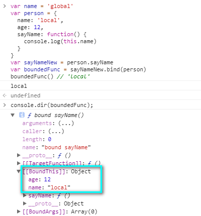
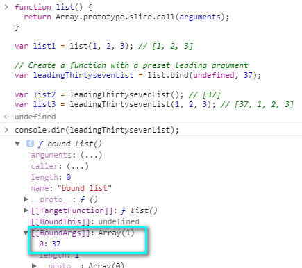

<h1 style="color: tomato; text-align: center;">this</h1>
从一道题目开始

```javascript
var name = 'global'
var person = {
  name: 'local',
  sayName: function() {
    console.log(this.name)
  }
}
console.log(this.name) // 1 - 'global'
person.sayName() // 2 - 'local'
var temp = person.sayName
temp() // 3 - 'global'
```
### 解释
 - 1 写在全局里面的 `this` 就是 `window`
 - 2 `this` 存在于某个函数里面谁调用的就是谁 这里是 `person` 在调用 `this` 指代 `person`
 - 3 至于第三个 `temp` 是由 `person.sayName` 赋值过来的 其实就是 `sayName` 这个函数 该函数存在于全局作用域调用的时候其实是 `window.temp()` 所以 `this` 指向的是 `window`
 

## `this` 的指向涉及到函数的调用 不同的调用方式得到的 `this` 具体的值也是不一样的

### 1 - 作为函数调用(普通调用) `this` 指代 `window`(非严格模式下) 或者 `undefined` (严格模式下)
``` javascript
 // 非严格模式下
var name = 'global';
function foo(){
  var boo = function (){
      console.dir(this.name)
  }
  boo();
};
foo(); // 'global'
 ```

``` javascript
// 严格模式下
'use strict'
var name = 'global';
function foo(){
  var boo = function (){
      console.dir(this.name)
  }
  boo();
};
foo(); // 会报错
 ```
 ### 2 - 作为方法调用(函数属于哪一个对象就称为哪一个对象的方法)
 ### 3 - 由构造函数构造出来的对象
 ``` javascript
 function Person(name, age, say){
   this.name = name;
   this.age = age;
   this.say = function() {
     console.log(this.name)
   }
 }
 var p = new Person('zhu', 12)
 p.say()
 ```

 ### 4 - `apply` `call`
 ``` javascript
 var zhu = {
   name: 'zhu',
   age: 12,
   say: function(name, age) {
     console.log(`${name}是${this.name}-${age}是${this.age}`)
   }
 }

 var zhen = {
   name: 'zhen',
   age: 15,
 }
 zhu.say.apply(zhen, ['姓名', '年龄'])
 zhu.say.call(zhen, '姓名', '年龄')
 zhu.say.apply(zhen, {0: '姓名', 1: '年龄', length: 2});
 ```
### 5 - [bind](https://developer.mozilla.org/zh-CN/docs/Web/JavaScript/Reference/Global_Objects/Function/bind)
#### 绑定 `this`
``` javascript
var name = 'global'
var person = {
  name: 'local',
  sayName: function() {
    console.log(this.name)
  }
}
var sayNameNew = person.sayName
var boundedFunc = sayNameNew.bind(person)
boundedFunc() // 'local'
```


#### 绑定参数

``` javascript
function list() {
  return Array.prototype.slice.call(arguments);
}

var list1 = list(1, 2, 3); // [1, 2, 3]

// Create a function with a preset leading argument
var leadingThirtysevenList = list.bind(undefined, 37);

var list2 = leadingThirtysevenList(); // [37]
var list3 = leadingThirtysevenList(1, 2, 3); // [37, 1, 2, 3]
```

