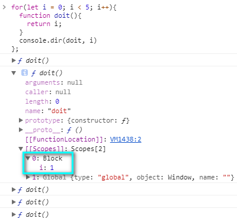
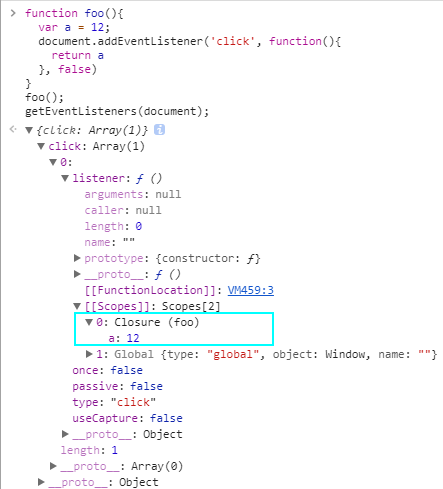

## 闭包
  - 闭包是指有权访问另一个函数作用域中的变量的函数
  - `javascript` 里面的闭包是跟变量作用域息息相关的
  - 下面的例子之中 `boo` 就是一个闭包 `boo` 能访问 `foo` 函数作用域里面的 `a` 变量

``` javascript
function foo(){
  var a = 1, b = 2;
  function boo() { return a * 10 };
// console.dir 能打印出当前对象的属性 并通过类似文件树样式的交互列表显示
  console.dir(boo);
}
foo() // [[Scope]]
```
### 当然写成函数里面 `return` 一个函数的形式也是可以的 这样写的目的是为了方便的利用闭包而已
``` javascript
function foo(){
  var a = 1;
  return function () { return a; };
}
console.dir(foo())
```

## `[[Scope]]`
  - 找到 `[[Scope]] scope` 就是作用域的意思
  - 有了这个作用域我们就能知道在当前域下能调用哪些变量或者方法
  - 在这个例子里面 `scope` 有两种 一种是全局作用域 叫做 `Global` 下面的值有很多了 比如
  - `Window` `Math` `Date`
  - 另外一种是 `closure` 就是我们说的闭包了 所以闭包是一个作用域的概念
  - `closure` 里面有个值 `a` 处于 `closure`
  - 之所以没有 `b` 是因为我们返回的函数里面没有涉及 `b` 其实 `b` 已经被销毁了

``` javascript
for(var i = 0; i < 5; i++){
  setTimeout(function(){ console.log(i) }, 1000 * i)
}

// 理想状态是每隔一秒依次打印出 0 1 2 3 4；
// 但是打印结果是 5 次 5 打印 5 次很好理解 但是打印出的全是 5 令人费解
// 原因: i 等于 5 是循环结束的条件 setTimeout 里面的函数每次引用的是结束之后的 i
// 那么如何让 i 保留下来呢
// 可以用闭包 给 setTimeout 加一层函数
```

其实上面的代码我们可以这样理解: 首先想想你为什么要用 `for` 循环 ? 回想第一次用 `for` 循环你都做了什么 ? 下面的代码你肯定见识过
``` javascript
for(var i = 0; i < 3; i++) {
  console.log(i);
}
```
其实这行代码等价于
``` javascript
var i = 0;
console.log(i);
i++;
console.log(i);
i++;
console.log(i);
i++;
```
那么我们出问题的代码等价于下面的代码, 你肯定没有疑问
``` javascript
var i = 0;
setTimeout(function(){ console.log(i) }, 0);
i++;
setTimeout(function(){ console.log(i) }, 1000);
i++;
setTimeout(function(){ console.log(i) }, 2000);
i++;
setTimeout(function(){ console.log(i) }, 3000);
i++;
setTimeout(function(){ console.log(i) }, 4000);
i++;
```
答案全是 `5` `setTimeout` 让特定的代码在某个时间段之后排队运行注定了只能在 `i` 变化之后执行 此时的 `i` 是最后的 `i`

解决方法如下:  

``` javascript
for(var i = 0; i < 5; i++){
  (function(i){
    setTimeout(function(){ console.log(i) }, 1000 * i)
  })(i)
}
// 立即执行函数相当于外层函数 里面的匿名函数相当于内层函数 因为闭包的存在
// 内层函数能访问到立即执行函数携带的参数 i
```
相当于下面的代码
``` javascript
var i = 0;
(function(i){
    setTimeout(function(){ console.log(i) }, 1000 * i);
})(i);
i++;
(function(i){
    setTimeout(function(){ console.log(i) }, 1000 * i);
})(i);
i++;
(function(i){
    setTimeout(function(){ console.log(i) }, 1000 * i);
})(i);
i++;
(function(i){
    setTimeout(function(){ console.log(i) }, 1000 * i);
})(i);
i++;
(function(i){
    setTimeout(function(){ console.log(i) }, 1000 * i);
})(i);
i++;
```
### 其他的解决方式

用闭包的方法可以解决上述的问题 但是太过于繁琐 ES6(ES2015)给我们提供了新的方法 并且极其的简单 只需要把 `var` 改成 `let` 就好了
``` javascript
for(let i = 0; i < 5;i++){
  setTimeout(function() { console.log(i) }, 1000 * i)
}
```
简答的来说就是 `let` 创造了一个块级作用域 这一点可通过 `console.dir` 来证明 同样是在 [[Scope]] 属性里面找到

``` javascript
for(let i = 0; i < 5; i++){
  function doit(){ return i; };
  console.dir(doit, i)
}
```


## `for` 循环里面的闭包的一般性测试

``` javascript
for(var i = 0; i < 5; i++){
  (function(i){
    function doit(){ return i; };
    console.dir(doit, i)
  })(i)
}
```

## `for` 循环里面的闭包的 `setTimeout` 测试
``` javascript
for(var i = 0; i < 5; i++){
  (function(i){
    function doit(){ return i; };
    function ok(){ console.dir(doit, i); }
    setTimeout(ok, 1000 * i)
  })(i)
}
```

## DOM 操作里面的闭包
### 我们希望点击每个按钮的时候出现对应的序数
``` html
<ul>
  <li>Apple</li>
  <li>Bpple</li>
  <li>Cpple</li>
  <li>Dpple</li>
  <li>Epple</li>
</ul>
```

``` javascript
var lis = document.getElementsByTagName('li');
for(var i = 0; i < lis.length; i++){
  lis[i].onclick = function(){
    alert(i)
  }
}
// 但是现在的代码是有问题的 点击每个按钮(li)的时候出现的全是 5
// 原因的话跟桑面的一样 我们的点击操作一定是发生在 for 循环之后的
// 我们需要一个闭包 保持对每次 i 的引用
// 方法如下面的代码展示
```
``` javascript
for(var i = 0; i < lis.length; i++){
  (function(i){
    lis[i].onclick = function(){
      alert(i)
    }
  })(i)
}
```
或者

``` javascript
for(var i = 0; i < lis.length; i++){
  lis[i].onclick = (function(i){
    return function(){
      alert(i)
    }
  })(i)
}
```


## 模拟私有变量

``` javascript
(function(){
  // 私有变量 函数
  var privateVar = 12
  function privateFunc() {
    return false
  }
  // 构造函数
  MyObj = function(){ /**/ }
  // 公有方法
  MyObj。prototype.pubMethod = function(){ /**/ }
})()
```